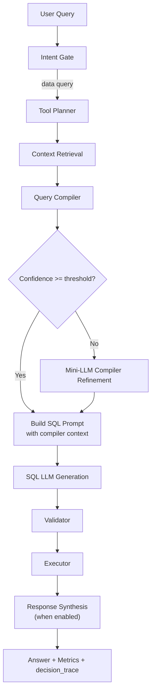

# Query Compiler Runtime

This document describes how DataChat compiles SQL-oriented questions into an explicit query plan before SQL generation.

> **Note**: Intent classification is now handled by `QueryAnalyzerAgent` (see `UNIFIED_ROUTING_ARCHITECTURE.md`). The query compiler runs after context retrieval for SQL-routed queries.

## Why This Exists

Before SQL generation, DataChat compiles a semantic plan from:

- query text
- live schema + DataPoint schema metadata
- operator templates (analytic phrase bank)

This reduces blind SQL prompting and makes table/join selection explicit, measurable, and debuggable.

## Runtime Flow



## Query Compiler Outputs

The compiler emits:

- `operators`: matched analytic operator keys
- `candidate_tables`: ranked table candidates
- `selected_tables`: final table subset for SQL generation
- `join_hypotheses`: suggested join keys
- `column_hints`: likely measure/dimension columns
- `confidence`: compiler confidence
- `path`: `deterministic` or `llm_refined`
- `reason`: short decision reason label

These are persisted to pipeline state and surfaced in:

- `decision_trace` (`stage=query_compiler`)
- response metrics:
  - `query_compiler_llm_calls`
  - `query_compiler_llm_refinements`
  - `query_compiler_latency_ms`

## Evaluation Coverage

Automated evaluation supports a compiler-specific run:

- mode: `compiler`
- dataset: `eval/compiler/grocery_query_compiler.json`
- thresholds:
  - `min_compiler_table_match_rate`
  - `min_compiler_path_match_rate`
  - `min_source_match_rate`

## Tracing and Observability

DataChat has two levels of observability:

1. Always-on decision trace

- Returned on every chat response as `decision_trace` (API and websocket).
- Captures branch decisions across the pipeline (`stage`, `decision`, `reason`, optional `details`).
- Includes query compiler decisions as `stage=query_compiler`.

2. Deep execution trace (on demand)

- Generated only when you run the trace script.
- Captures exact LLM prompts/responses and SQL-internal step outputs.

### Run a deep trace

Use:

```bash
python scripts/trace_query_flow.py \
  --query "Which stores have the largest gap between inventory movement and recorded sales?" \
  --output reports/query_trace_gap_compiler_v2.json
```

Trace file sections:

- `result_summary`: final SQL/answer/latency/decision trace
- `sql_internal_trace`: catalog plan, query compiler output, SQL prompt metadata, parsed SQL output
- `llm_trace`: exact request/response payloads for each provider call

## Performance Guardrails

- Deterministic compiler path runs first and is cheap.
- Mini-LLM refinement only runs when:
  - confidence is below `PIPELINE_QUERY_COMPILER_CONFIDENCE_THRESHOLD`
  - candidate count is bounded by `PIPELINE_QUERY_COMPILER_LLM_MAX_CANDIDATES`
  - fast and main SQL providers are not equivalent

Knobs:

- `PIPELINE_QUERY_COMPILER_ENABLED`
- `PIPELINE_QUERY_COMPILER_LLM_ENABLED`
- `PIPELINE_QUERY_COMPILER_LLM_MAX_CANDIDATES`
- `PIPELINE_QUERY_COMPILER_CONFIDENCE_THRESHOLD`
