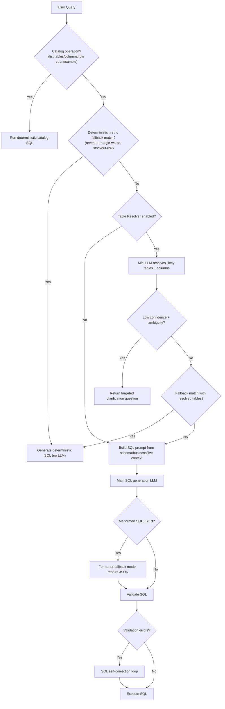
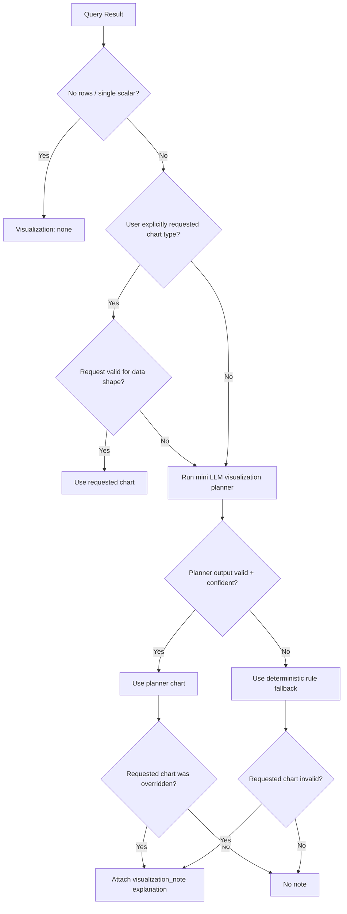

# SQL Routing and Visualization Decision Tree

This document summarizes how DataChat routes SQL generation and visualization selection after the latest runtime updates.

## SQL Routing Overview

## Visualization Hint Overview

